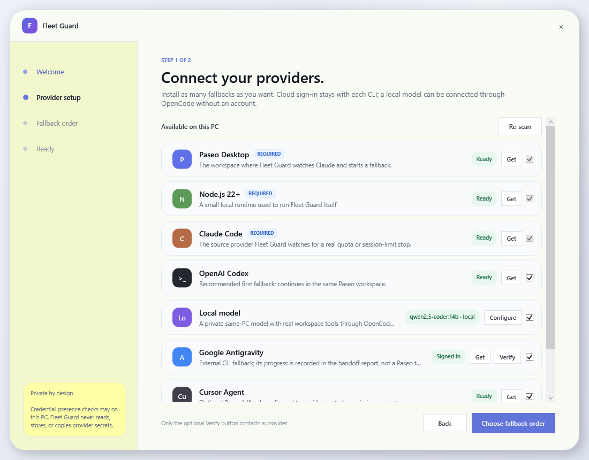
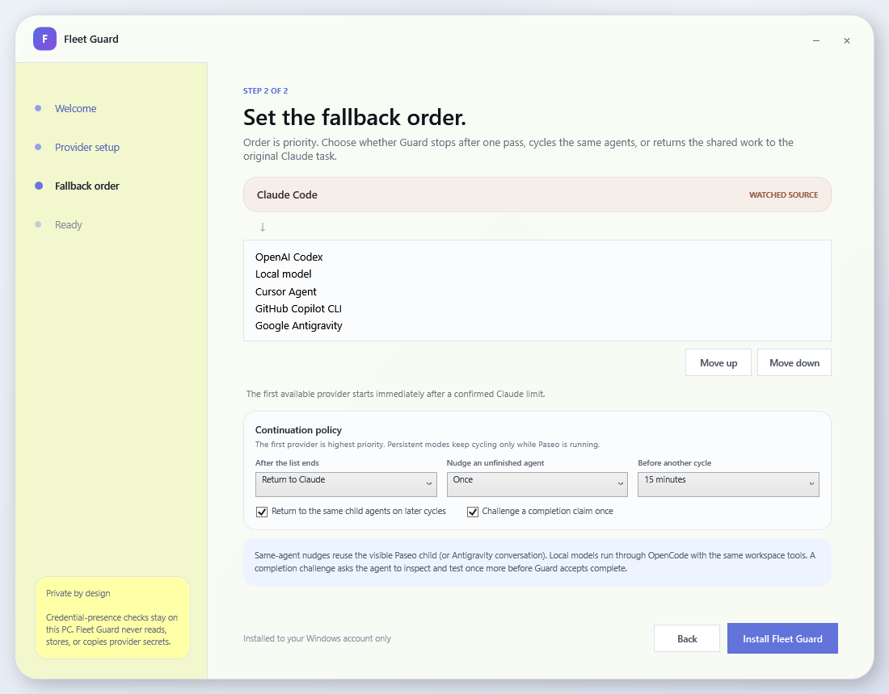

<p align="center">
  
</p>

<h1 align="center">Fleet Guard</h1>

<p align="center">
  A friendly Windows companion for Paseo that keeps long-running Claude jobs moving when a session limit gets in the way.
</p>

<p align="center">
  <a href="https://github.com/denjiaki/fleet-guard/releases/tag/v4.0.0-beta.1"><strong>Fleet Supervisor 4 beta</strong></a>
  ·
  <a href="#getting-started">Getting started</a>
  ·
  <a href="#how-it-continues-a-job">How it works</a>
</p>

> **Beta software:** Fleet Guard is useful today, but it is still young. Keep an eye on important work and report anything surprising.

Fleet Guard watches a root Claude Code task inside [Paseo](https://paseo.sh/). When Claude reports a real session or quota limit, Fleet Supervisor hands the same workspace and task context to the exact provider **and model** you chose—including another Claude model or a model running locally on your PC. It can nudge an unfinished agent, check a premature completion claim, cycle through fallbacks, and return the work to the original Claude task after a cooldown.

Version 4 also adds a model Council to Paseo itself: **Skeptic Review** in the composer reviews the latest task context, while the brain icon beneath a message reviews that specific message and its attachments. The configured reviewers run independently and in parallel, then the original task receives their conclusions and writes one digest.

It does **not** bypass limits or share accounts. Every fallback uses its own official CLI, login, permissions, subscription, and quota.

## A setup wizard instead of a config file

The Windows setup app finds the providers already available on the computer, offers friendly **Get** and **Verify** controls, asks Paseo for each provider's current model catalog, and lets the user choose an exact model, priority, model-specific role, Council lens, and continuation policy. Model fields remain editable when a CLI cannot publish a catalog.

<p align="center">
  
</p>

<p align="center">
  
</p>

## What it can do

- Continue a quota-blocked Claude task with OpenAI Codex, a local model, Google Antigravity, Cursor Agent, or GitHub Copilot CLI.
- Route Fable's separate weekly allowance to another selected Claude model before leaving Anthropic, or skip that step and move directly to another provider/model.
- Select exact models instead of only choosing a provider family.
- Give every automatic-handoff model a built-in role—progress reporting, bug checking, QA, or skepticism—or a custom highest-priority system prompt.
- Configure an independent Council roster and review lens for each exact model; Council prompts never inherit automatic-handoff instructions.
- Review the latest task context from Paseo's **Skeptic Review** composer button.
- Review one user or assistant message, including uploaded PDFs and file attachments, from the brain icon beneath that message.
- Keep Codex, local-model, Cursor, and Copilot handoffs visible as child tasks in the same Paseo workspace.
- Prioritize providers in any order.
- Nudge the same unfinished child agent instead of constantly creating replacements.
- Challenge a completion claim once by checking the workspace, diff, and tests.
- Reuse child sessions on later cycles so their conversational context survives.
- Return to the original Claude task after a configurable cooldown.
- Resume a recent interrupted continuation chain after Paseo is reopened.
- Stay out of Alt+Tab and the taskbar through a native windowless launcher.
- Exit completely when Paseo's daemon is gone. There is no Windows-login service or permanent watchdog.

## Getting started

1. Download the standalone `FleetGuardSetup.exe` from the [v4.0.0 beta 1 release](https://github.com/denjiaki/fleet-guard/releases/tag/v4.0.0-beta.1). A traditional ZIP is available on the same release page if you prefer it.
2. Double-click the downloaded installer—there is nothing else to extract or keep beside it.
3. Follow the provider cards and finish any requested CLI sign-ins.
4. Choose your fallback priority and continuation policy.
5. From then on, start Paseo with **Fleet Supervisor - On Paseo** from the Desktop or Start Menu.

The Council buttons require the Fleet Supervisor Paseo build, which extends Paseo's official plugin API with native composer and message action slots. The change is implemented in the companion `fleet-supervisor-ui` Paseo branch and does not use DOM injection. Stock Paseo 0.4.0 can still run automatic handoffs, but it cannot render these two new plugin actions.

Windows may show an **Unknown publisher** warning because this community beta is not code-signed. The complete C# and JavaScript source is here for review.

### Requirements

- Windows 10 or Windows 11
- Paseo Desktop
- Node.js 22 or newer
- Claude Code, installed and signed in
- At least one fallback provider you can use

## Use a model running on your PC

Choose **Local model** on the provider page to add an Ollama, LM Studio, llama.cpp, or other OpenAI-compatible server running on the same computer.

1. Install [OpenCode](https://opencode.ai/docs/) so the model has a real coding-agent harness.
2. Start the local model server. Ollama's default endpoint is `http://127.0.0.1:11434/v1`.
3. Click **Configure**, then **Find models**.
4. Choose one of the models returned by the server and place **Local model** anywhere in the fallback order.

Fleet Guard creates a separate OpenCode profile for local handoffs. It gives that profile read, edit, and shell tools in the shared workspace without changing the user's normal OpenCode configuration. The endpoint is restricted to the same PC, and Fleet Guard does not request or store a local API key.

Coding agents need reliable tool calling and a useful context window. If a model struggles to use tools, try a coding-oriented model and raise its context to roughly 16k–32k before judging the loop.

## How it continues a job

With the recommended policy, the flow is:

```text
Claude reaches a confirmed session limit
  → try providers in your chosen priority order
  → nudge unfinished agents and audit completion claims
  → wait for the configured cooldown
  → retry the original Claude task
  → if Claude is still limited, reuse the fallback sessions and repeat
```

A genuine request for human input remains a hard stop. A second, audited completion verdict also stops the chain—otherwise an automatic loop would never know when the work was actually done.

Fully quitting Paseo, including its daemon, stops Fleet Guard. Reopening Paseo through the combined shortcut can resume a recent interrupted chain.

## Exact models and model-specific roles

Each fallback card contains an editable model picker populated through Paseo's provider model API. A **Use for** switch can add one highest-priority instruction to every handoff created for that exact model. Built-in roles are deliberately narrow; a custom prompt is preserved verbatim and remains subordinate only to Fleet Supervisor's safety and completion contract.

When the watched source is Fable, the optional **Next Claude model** node can route a Fable allowance stop to another Anthropic model before the cross-provider list begins. For other Claude source models, setup explains that there is no separate Fable-style weekly allowance; normal account, session, and provider limits can still move the chain forward.

## Council reviews inside Paseo

Council membership is configured separately from fallback behavior. Enabling a model as a Council reviewer reveals a Council-only lens: strengths and weaknesses, bug checking, QA, progress audit, or a custom review prompt.

- **Skeptic Review** sends the latest projected task context to every selected reviewer.
- The brain icon beneath a message sends only that message plus supported attachments and images.
- Reviewers are created as parallel child tasks with review-only instructions and a structured response contract.
- Results return to the original task, which reconciles agreement and disagreement into one user-facing digest.

The local bridge between the Paseo plugin and Fleet Supervisor listens only on `127.0.0.1`, requires a random private bearer token, rejects requests over 2 MB, and never exposes provider credentials.

## Antigravity (Gemini) — experimental

Paseo drives external agents over the Agent Client Protocol, and Antigravity's
`agy` CLI has no ACP mode, so Paseo could not address it at all — an
`antigravity` fallback entry was silently dead and offered no model list.

`payload/src/antigravity-acp.mjs` bridges that gap: it speaks ACP to Paseo and
drives `agy --print --output-format stream-json` underneath, advertising the
real Gemini catalogue so the model picker works.

> **Experimental — the happy path is unproven.** The ACP handshake, session
> lifecycle, model catalogue (14 Gemini models, live in Paseo) and error
> propagation are all verified against the real CLI. A **successful Gemini turn
> is not**: the account used during development was out of quota, so
> `result.response` has only ever been observed empty on the error path. Replies
> also arrive all at once rather than streaming, because `agy`'s `step_update`
> events carry no text.

Full detail, including how to finish verification: [docs/antigravity-acp.md](docs/antigravity-acp.md).

## Privacy and permissions

Provider checks stay on the local computer. Fleet Guard does not read, copy, transmit, or store provider credentials. The optional **Verify** button sends one short, no-tools request to the selected provider and may use a small amount of its quota.

Fleet-created Cursor tasks use an unattended provider profile. Codex uses auto-review, Copilot uses allow-all, and Antigravity uses its non-interactive permission mode. Those settings apply only to fallback tasks created by Fleet Guard. Council reviewers are explicitly told not to continue the task or edit the workspace.

## Status, settings, and removal

- Open **Fleet Guard Settings** from the Start Menu to change providers, priority, nudges, cooldown, or continuation behavior.
- Run `STATUS.cmd` from the installation folder to see the current policy, latest chain, next retry, and recent log entries.
- Run `UNINSTALL.cmd` to stop Fleet Guard and remove its shortcuts and Fleet-only Cursor/local-model profiles. Logs and configuration remain available for recovery.

## Build and test from source

The desktop interface and windowless launcher target .NET Framework 4.5.2. The continuation engine uses Node.js 22+. The build embeds the complete runtime payload and Fleet Supervisor Paseo plugin into the setup executable, so the resulting EXE works by itself. Native Council buttons additionally require the companion Paseo UI branch until the action-slot extension is upstreamed.

```powershell
npm ci --prefix payload
npm test --prefix payload
powershell -ExecutionPolicy Bypass -File .\package-release.ps1
```

The finished standalone EXE is written to `desktop/bin/`; the full ZIP is written to `release/`.

### Running a patched Paseo build

Native Council buttons and the plugin surface need Paseo built from source with
`paseo-plugin-action-slots.patch` applied. Three things bite when you do that:

1. **Close Paseo before packaging.** electron-builder clears its output
   directory, and Windows will not let it delete a running `Paseo.exe`. The
   failure looks unrelated — `app-builder.exe process failed
   ERR_ELECTRON_BUILDER_CANNOT_EXECUTE` — but the real line above it is
   `remove ...\Paseo.exe: Access is denied`.

2. **Windows needs symlink privileges to build the installer.** electron-builder
   extracts a code-signing toolchain containing macOS symlinks and fails with
   `Cannot create symbolic link : A required privilege is not held by the
   client`. Enable Developer Mode (Settings → System → For developers), or run
   the packaging step elevated. Only the installer needs this; `win-unpacked` is
   produced fine without it, and a shortcut to it works identically.

3. **Delete `resources/app-update.yml`, or the patch will silently undo itself.**
   The generated build points its auto-updater at upstream `getpaseo/paseo`. If
   it ever updates, the patched build is replaced by stock Paseo, which has no
   plugin system — and Paseo then refuses to start at all, because a config
   containing `pluginsEnabled`/`plugins` fails its strict schema:

   ```
   [Config] Invalid config in ~/.paseo/config.json:
     - : Unrecognized keys: "pluginsEnabled", "plugins"
   ```

   Running from `win-unpacked` with the updater file removed avoids this
   entirely, which is why a shortcut is preferred over installing.

## License

Fleet Guard is available under the [MIT License](LICENSE). It is an independent community utility and is not affiliated with Anthropic, OpenAI, Google, Cursor, GitHub, or Paseo.
